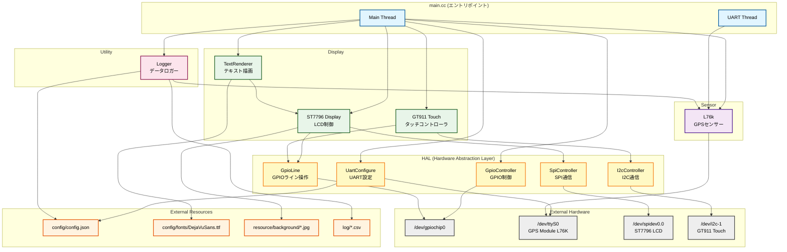
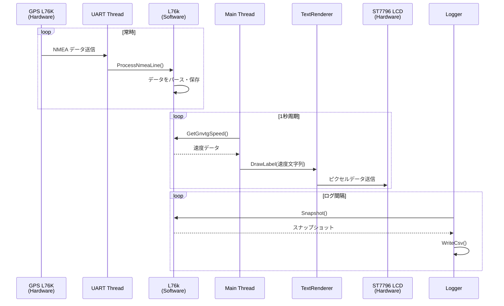
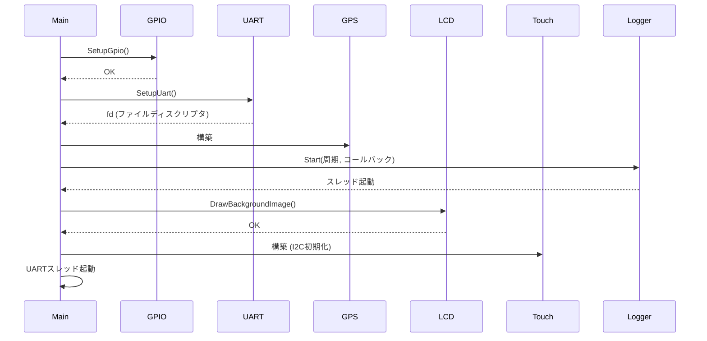
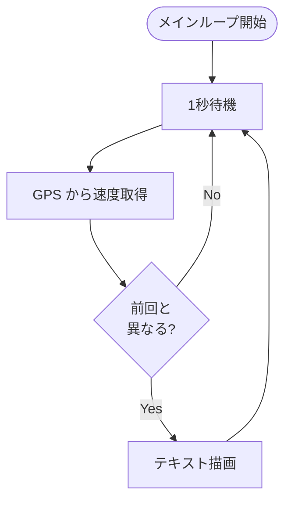
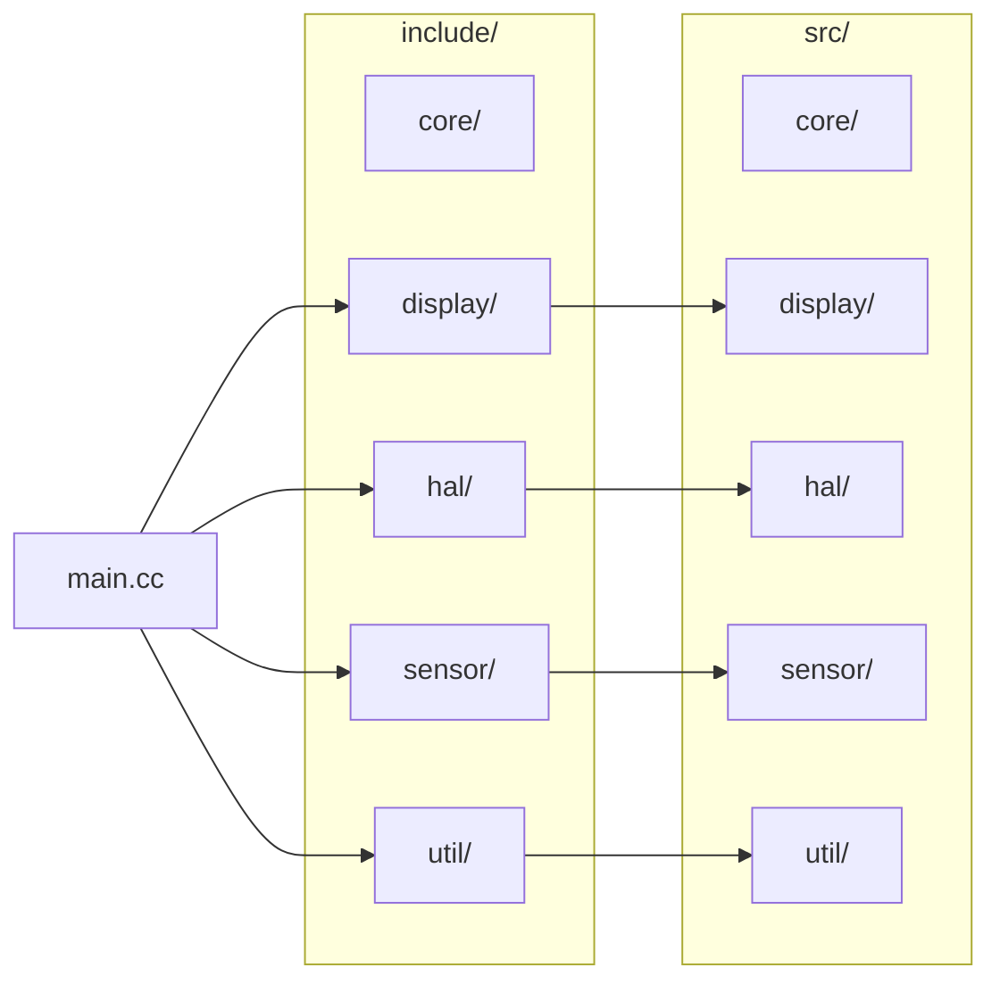
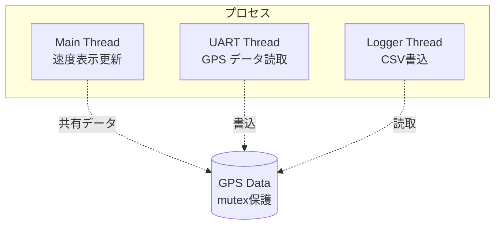

# サイクルコンピュータ アーキテクチャ

🚧 **TODO**: コードで正当性チェック（現在は雛形作成の状態）

## システム概要

本システムは、GPS センサーからデータを取得し、LCD ディスプレイに速度などの情報を表示する、Raspberry Pi ベースのサイクルコンピュータです。

## 全体構成



## コンポーネント詳細

### Main (main.cc)

システムのエントリポイント。以下の2つのスレッドで構成されます。

#### Main Thread
- 各コンポーネントの初期化
- LCD への背景画像表示
- 1秒周期での速度表示更新
- タッチイベント処理（将来的に）

#### UART Thread
- GPS モジュールから NMEA センテンスを読み取り
- `L76k::ProcessNmeaLine()` でデータをパース
- バッファリングして行単位で処理

### HAL (Hardware Abstraction Layer)

ハードウェアへの低レベルアクセスを抽象化するレイヤー。

- **GpioController**: GPIO の初期化と管理
- **UartConfigure**: UART ポートの設定とオープン
- **SpiController**: SPI 通信の制御
- **I2cController**: I2C 通信の制御
- **GpioLine**: 個々の GPIO ライン操作

### Sensor

#### L76k (GPS センサー)
- NMEA センテンス（GNRMC, GNVTG, GNGGA）のパース
- スレッドセーフなデータアクセス（mutex 使用）
- スナップショット機能による安全なデータ取得

### Display

#### ST7796 Display
- SPI 経由での LCD 制御
- 画面クリア、矩形描画、画像表示機能
- 320x480 解像度対応

#### GT911 Touch
- I2C 経由でのタッチコントローラ制御
- マルチタッチ対応（最大5点）
- 割り込みピン監視

#### TextRenderer
- FreeType ライブラリを使用した文字描画
- UTF-8 対応
- RGB565 カラーフォーマット
- 折り返し、中央寄せ対応

### Utility

#### Logger
- GPS データの CSV ファイル出力
- 設定可能なログ間隔
- コールバック機能による柔軟なログ処理

## データフロー



## 処理フロー

### 初期化シーケンス



### メインループ



## ファイル構成マップ



## 設定ファイル

### config/config.json
```json
{
  "uart": {
    "baudrate": 9600
  },
  "logger": {
    "log_interval_ms": 1000,
    "log_on": true
  }
}
```

## ハードウェア接続

| デバイス | インターフェース | デバイスファイル | 説明 |
|---------|----------------|-----------------|------|
| L76K GPS | UART | /dev/ttyS0 | GPSセンサー |
| ST7796 LCD | SPI | /dev/spidev0.0 | 3.5インチLCD |
| GT911 Touch | I2C | /dev/i2c-1 | タッチコントローラ |
| GPIO | GPIO | /dev/gpiochip0 | 汎用I/O制御 |

### GPIO ピン配置

| 機能 | BCM番号 | 説明 |
|-----|---------|------|
| LCD RST | 27 | LCDリセット |
| LCD DC | 22 | データ/コマンド選択 |
| LCD BL | 18 | バックライト制御 |
| Touch INT | 4 | タッチ割り込み |
| Touch RST | 1 | タッチリセット |
| UART RX | 15 | GPS受信 |
| UART TX | 14 | GPS送信 |

## スレッド構成



## 依存ライブラリ

- **libgpiod**: GPIO 制御
- **nlohmann/json**: JSON パース
- **FreeType2**: フォント描画
- **stb_image**: 画像ロード
