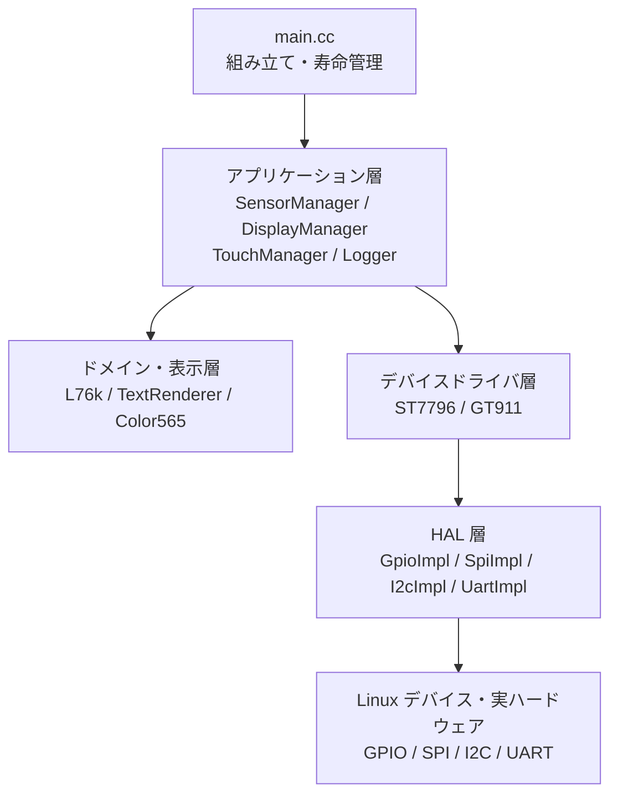
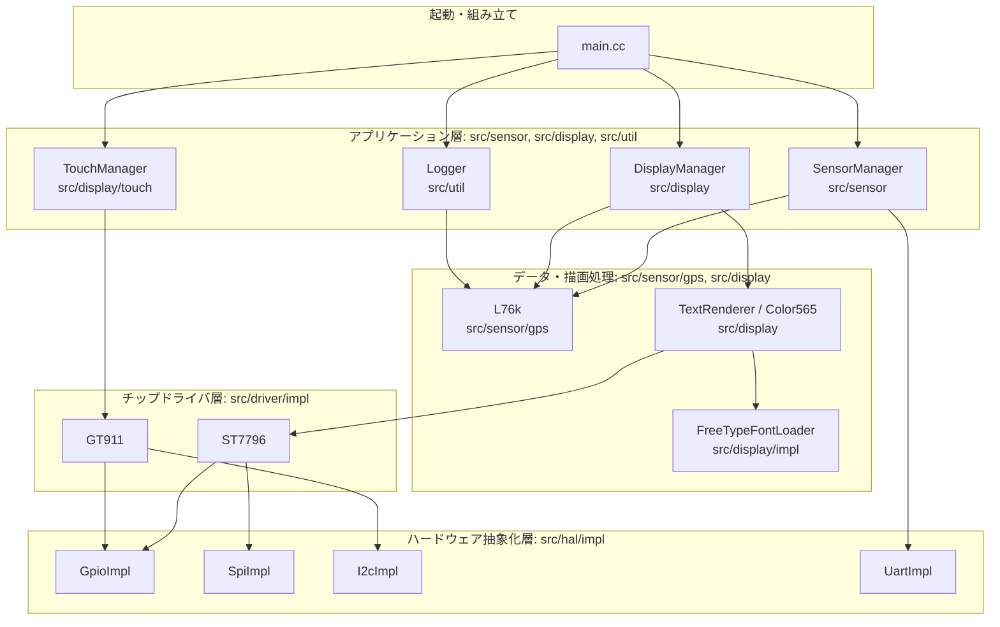
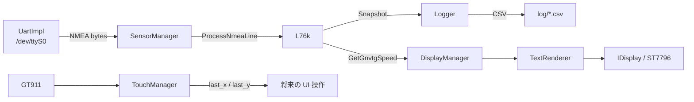

# cycom クラス構成・アーキテクチャ

## 1. 目的と全体像

`cycom` は Raspberry Pi 上で動作するサイクルコンピュータです。GPS から NMEA 0183 形式の位置・速度情報を受信し、LCD へ表示し、必要に応じて CSV に記録します。タッチパネルの入力監視も同時に行います。

設計は、ハードウェア依存部をインターフェースで抽象化した 5 層構造です。

`main.cc` が具体実装を生成し、上位層へ参照またはポインタを渡します。したがって、クラス自身はデバイスファイルや特定のチップ実装に直接依存せず、下位層の抽象インターフェースに依存します。この依存性注入により、テストでは HAL とデバイスドライバをモックに置き換えられます。

## 2. ディレクトリと責務

| ディレクトリ | 内容 |
| --- | --- |
| `include/` | 公開ヘッダー。クラスの利用側が依存する API を定義する。 |
| `src/` | 公開ヘッダーに対応する実装。 |
| `include/hal/`・`src/hal/` | Linux の GPIO、SPI、I2C、UART を覆うハードウェア抽象化層。 |
| `include/driver/`・`src/driver/` | ST7796 LCD、GT911 タッチコントローラのチップ固有ドライバ。 |
| `include/sensor/`・`src/sensor/` | GPS の NMEA パースとセンサー受信スレッド。 |
| `include/display/`・`src/display/` | FreeType を利用する文字描画、LCD 更新、タッチ監視。 |
| `include/util/`・`src/util/` | CSV ログ、時間定数、終了フラグ。 |
| `tests/` | Google Test/Google Mock によるテスト。現在は `TextRenderer` の単体テストが中心。 |
| `config/config.json` | UART 速度、ログ有効化、CSV 出力周期の設定。 |

`include/core/` と `src/core/` は現時点で実装を持たない予約領域です。

### 2.1 論理層とフォルダ配置の対応

前節の Mermaid 図は、実行時の**責務と依存方向**を表しています。一方、フォルダはソースコードを機能別に置くための**物理的な配置**です。両者は完全な一対一対応ではありません。特に `display/` は文字描画というドメイン処理と、画面更新スレッドというアプリケーション処理を両方含みます。

読み方は次のとおりです。

| 観点 | 対応する場所 | 意味 |
| --- | --- | --- |
| 起動時の組み立て | `main.cc` | どの実装を使うかを決め、依存先をコンストラクタへ渡す。 |
| 定期処理・スレッド | `src/sensor/`, `src/display/`, `src/util/` | GPS 受信、画面更新、タッチ監視、ログ記録を並行実行する。 |
| GPS のデータ解釈 | `src/sensor/gps/` | NMEA 文を構造体へ変換し、共有状態として保持する。 |
| 文字をピクセルへ変換 | `src/display/` | FreeType のグリフを RGB565 の描画行に変換する。 |
| チップ固有の制御 | `src/driver/impl/` | ST7796 と GT911 のレジスタ操作を担当する。 |
| OS・デバイスファイルの操作 | `src/hal/impl/` | GPIO、SPI、I2C、UART を Linux API 経由で操作する。 |
| 抽象 API の定義 | `include/**/interface/` | 上位層が具体チップや Linux API に依存しないための境界。 |

つまり、フォルダを上から下へ読む場合は `main.cc` -> `sensor` / `display` / `util` -> `driver` -> `hal` の順が基本です。`include/` は同じ構成をヘッダーとして写したものであり、実装フォルダ `src/` の利用契約を定義します。

## 3. 起動から終了まで

### 3.1 `main()` が行う組み立て

`main.cc` は次の順序でオブジェクトを生成します。

1. `SIGINT` と `SIGTERM` のハンドラーを設定する。
2. LCD 用の GPIO 3 本、SPI、タッチ用 GPIO 2 本、I2C、GPS 用 UART を生成する。
3. `ST7796` に `ISpi` と 3 本の `IGpio`、`GT911` に `II2c` と 2 本の `IGpio` を注入する。
4. GPS の状態を保持する `sensor::L76k` を生成する。
5. `Logger`、`SensorManager`、`DisplayManager`、`TouchManager` を生成する。各管理クラスはコンストラクタで専用スレッドを起動する。
6. メインスレッドは 100 ms 間隔で終了シグナルを待つ。ローカル変数の破棄時に、各管理クラスのデストラクタがスレッド停止と `join` を担う。

UART を開けない場合は `main()` がエラーを表示して終了します。

### 3.2 依存関係とデータフロー

GPS データの唯一の保有者は `L76k` です。`SensorManager` は書き込み担当、`Logger` と `DisplayManager` は読み取り担当です。`L76k::Snapshot()` は内部 mutex により 3 種類の NMEA データを一貫したコピーとして返します。

## 4. HAL 層

HAL は `hal` 名前空間にあります。インターフェースはハードウェアを意識しない最小限の操作だけを公開し、実装クラスは Linux のデバイス API または `libgpiod` を扱います。

| 抽象クラス | 実装クラス | 実装ファイル | 役割 |
| --- | --- | --- | --- |
| `IGpio` | `GpioImpl` | `src/hal/impl/gpio_impl.cc` | GPIO の入出力、エッジ待機。`libgpiod` を使用する。 |
| `ISpi` | `SpiImpl` | `src/hal/impl/spi_impl.cc` | SPI の送信、受信、全二重転送。 |
| `II2c` | `I2cImpl` | `src/hal/impl/i2c_impl.cc` | 8/16 bit レジスタアドレスを持つ I2C 読み書き。 |
| `IUart` | `UartImpl` | `src/hal/impl/uart_impl.cc` | シリアルポートのファイル記述子取得、読み書き、開閉状態確認。 |

### 4.1 `hal::IGpio` と `hal::GpioImpl`

`IGpio` は `Set()`、`Get()`、`RequestRisingEdge()`、`RequestFallingEdge()`、`WaitForEvent()` を定義します。`GpioImpl` は GPIO チップ名、オフセット、出力設定、初期値を受け取り、LCD の D/C・RST・BL および GT911 の RST・INT を操作します。

### 4.2 `hal::ISpi` と `hal::SpiImpl`

`ISpi` は送信専用の `WriteBytes()`、受信専用の `ReadBytes()`、全二重の `Transfer()` を持ちます。`SpiImpl` は指定デバイスを開き、速度、モード、ワード長を設定します。現在の起動構成では `/dev/spidev0.0`、40 MHz、mode 0、8 bit を ST7796 に使います。

### 4.3 `hal::II2c` と `hal::I2cImpl`

`II2c` は 8 bit レジスタ用の `ReadByte()`、`WriteByte()`、`ReadBytes()`、`WriteBytes()` と、GT911 用の 16 bit レジスタ用 `Read16()`、`Write16()` を持ちます。現在は `/dev/i2c-1` のアドレス `0x5D` を使います。

### 4.4 `hal::IUart` と `hal::UartImpl`

`IUart` は `GetFileDescriptor()`、`Read()`、`Write()`、`IsOpen()` を提供します。`UartImpl` は termios を設定して UART を開きます。`main.cc` は `/dev/ttyS0`、9600 baud で生成し、得たファイル記述子を `SensorManager` に渡します。

## 5. デバイスドライバ層

ドライバは `driver` 名前空間にあり、上位層がチップ名を知らずに使えるインターフェースを定義します。

### 5.1 `driver::IDisplay` と `driver::ST7796`

`IDisplay` は LCD の共通描画 API です。

| API | 意味 |
| --- | --- |
| `Clear(rgb565)` | 画面全体を RGB565 色で塗りつぶす。既定値は白。 |
| `DrawRGB565Line(x, y, pixels, len)` | 1 行分の RGB565 ピクセル列を描画する。`TextRenderer` の最終出力に使う。 |
| `DrawBackgroundImage(path)` | 画像ファイルを背景として描画する。成功可否を返す。 |
| `GetWidth()` / `GetHeight()` | 画面寸法を返す。 |

`ST7796` はこのインターフェースを実装する LCD コントローラです。解像度は `kWidth = 320`、`kHeight = 480`、ピクセル形式は RGB565 です。コンストラクタで `ISpi`、データ/コマンド選択 GPIO、リセット GPIO、バックライト GPIO を受け取り、初期化します。固有 API として矩形塗りつぶしの `DrawFilledRect()`、RGB565 バッファ全体転送の `BlitRGB565()` を持ちます。内部ではアドレスウィンドウの設定、コマンド/データの切替、チャンク送信を行います。

### 5.2 `driver::ITouch` と `driver::GT911`

`TouchPoint` は `x`、`y`、`touched` を持つ単純な値型です。`ITouch` は `GetTouchPoint()` と `IsTouched()` を公開します。

`GT911` はこのインターフェースを実装する静電容量式タッチコントローラです。`II2c`、リセット GPIO、割り込み GPIO、I2C アドレスを受け取ります。画面座標の上限は `kCoordinateXMax = 320`、`kCoordinateYMax = 480` です。初期化時にリセットと座標解像度を設定し、読み取り時にはステータスと最初のタッチ点の X/Y レジスタを参照し、処理後にステータスをクリアします。

### 5.3 `driver::IGps` と `driver::GpsData`

`IGps` は `GetData()`、`IsValid()`、`ReadAndParse()` を定義する GPS の汎用インターフェースです。値型 `GpsData` は緯度、経度、高度、km/h 速度、UTC 時刻、有効フラグをまとめます。

現行の `sensor::L76k` は NMEA 文を詳細な構造体として保持するため、`IGps` は実装していません。従って `IGps` は将来の統一 GPS API 用の未接続な抽象化です。

## 6. GPS・センサー層

### 6.1 NMEA 値型

`sensor::L76k` の公開ヘッダーは、次の受信文ごとの構造体を定義します。各構造体は未受信または不明な浮動小数値を `NaN` で初期化します。

| 型 | 対象文 | 主な内容 |
| --- | --- | --- |
| `GNRMC` | RMC | UTC 時刻・日付、位置、測位有効性、ノット速度、真方位、磁気偏角、測位モード。 |
| `GNVTG` | VTG | 真方位・磁方位、ノット速度、km/h 速度、測位モード。 |
| `GNGGA` | GGA | UTC 時刻、位置、測位品質、衛星数、HDOP、高度、ジオイド高、DGPS 情報。 |
| `GnssSnapshot` | - | 上記 3 構造体のコピーを 1 つにまとめた読み取り用スナップショット。 |

位置は NMEA の `dddmm.mmmm` 形式で保持され、方位は別フィールドの `N/S/E/W` で表します。`GNRMC::data_status` は `A` が有効、`V` が無効です。`GNGGA::quality` は 0 が無効、1 が SPS、2 が DGPS、4 が RTK Fix、5 が RTK Float を表します。

### 6.2 `sensor::L76k`

`L76k` は L76K GPS モジュールから届く NMEA 行のパーサ兼状態ストアです。

| API | 役割 |
| --- | --- |
| `ProcessNmeaLine(line)` | NMEA 文を種別に応じて解析し、該当する内部データを更新する。 |
| `Snapshot() const` | mutex で保護された `GNRMC`、`GNVTG`、`GNGGA` のコピーを返す。 |
| `GetGnvtgSpeed()` | 最新の VTG 文に含まれる速度を取得する。表示用に使用する。 |

内部の `ParseGnrmc()`、`ParseGnvtg()`、`ParseGngga()` が文ごとの解析を担い、`SplitString()` がフィールドを分割します。内部状態と読み取りは `mtx_` で同期されます。

### 6.3 `sensor::SensorManager`

`SensorManager` は GPS 受信スレッドの管理者です。UART のファイル記述子と `L76k` への参照を保持します。コンストラクタが `Start()` を呼び、デストラクタが `Stop()` を呼びます。

`SensorLoop()` は UART から受け取ったバイト列を行単位に組み立て、完成した NMEA 行を `L76k::ProcessNmeaLine()` に渡します。将来、I2C/SPI など別センサーの取り込みを追加するためのアプリケーション層の拡張地点でもあります。

## 7. 表示層

### 7.1 `ui::Color565`

`Color565` は `uint16_t value` に RGB565 色を保持する値型です。`RGB(r, g, b)` で 8 bit RGB から変換し、`Black()`、`White()`、`Gray()` で標準色を生成します。LCD とテキスト描画の色表現を統一します。

### 7.2 `ui::IFontLoader` と `ui::FreeTypeFontLoader`

`IFontLoader` はフォントエンジンを抽象化します。ネストした `GlyphData` はビットマップの幅・高さ・ベアリング・送り幅・ピッチ・8 bit アルファ配列を持ちます。

| API | 役割 |
| --- | --- |
| `LoadChar(codepoint, glyph_data)` | Unicode コードポイントのグリフとメトリクスをロードする。 |
| `SetPixelSize(size_px)` | フォントのピクセルサイズを設定する。 |
| `GetLineHeightPx()` | 行高を返す。 |
| `GetAscentPx()` / `GetDescentPx()` | ベースラインから上・下のメトリクスを返す。 |

`FreeTypeFontLoader` は FreeType の `FT_Library` と `FT_Face` を所有する実装です。指定されたフォントファイルを開き、FreeType の 26.6 固定小数点値をピクセル値へ変換して `IFontLoader` の API として公開します。

### 7.3 `ui::TextRenderer`

`TextRenderer` は `IDisplay` と `IFontLoader` を受け取り、UTF-8 文字列を LCD に描画するクラスです。ST7796 や FreeType の詳細を直接知らないことが重要です。

主な公開 API は次のとおりです。

| API | 役割 |
| --- | --- |
| `DrawLabel(panel_x, panel_y, panel_w, panel_h, utf8, center)` | パネル背景を塗り、テキストを中央寄せまたは左寄せで描画する。 |
| `DrawText(x, y, utf8)` | UTF-8 テキストを指定ベースライン位置から描画し、`TextMetrics` を返す。改行と折り返しに対応する。 |
| `SetColors(foreground, background)` | 文字色とパネル背景色を設定する。 |
| `SetFontSizePx(font_size_px)` | フォントサイズを設定する。6 px 未満は 6 px に補正される。 |
| `SetLineGapPx(line_gap_px)` | 行間を設定する。負値は 0 に補正される。 |
| `SetWrapWidthPx(wrap_width_px)` | 自動折り返し幅を設定する。0 は折り返しなし。 |

`TextMetrics` は最長行の幅、全体の高さ、ベースライン位置を返します。内部では以下を行います。

- UTF-8 の 1〜4 byte シーケンスをコードポイントにデコードする。
- `IFontLoader` からグリフを取得し、`(font size, codepoint)` をキーにキャッシュする。
- グレースケールのグリフアルファと前景/背景 RGB565 をブレンドする。
- 行ごとの RGB565 ピクセル配列を `IDisplay::DrawRGB565Line()` に渡す。

キャッシュは現状上限や失効ポリシーを持ちません。多数の異なる文字サイズ・文字種を長時間描画する設計に拡張する場合は、メモリ使用量を管理する必要があります。

### 7.4 `display::DisplayManager`

`DisplayManager` は表示専用スレッドを管理します。`IDisplay` と `L76k` への参照、`FreeTypeFontLoader` の所有権、`TextRenderer` を持ちます。

初期画面を表示した後、`DisplayLoop()` が 1 秒周期で `L76k::GetGnvtgSpeed()` の値を取り、`TextRenderer` 経由で LCD に速度を表示します。背景画像の表示は `IDisplay::DrawBackgroundImage()` に委譲します。ドライバを直接 `ST7796` に固定していないため、表示 API を実装したテストダブルでも利用できます。

### 7.5 `display::TouchManager`

`TouchManager` は `ITouch` を受け取り、タッチ監視用スレッドを起動します。最後に観測した X/Y 座標を `std::atomic<int>` に格納します。

| API | 役割 |
| --- | --- |
| `GetLastTouchPoint() const` | 最後に検出した座標とタッチ有無を `TouchPoint` として返す。 |
| `IsTouched() const` | 保存済み座標を基にタッチ状態を返す。 |

`TouchLoop()` は GT911 のイベントまたは状態を監視し、タッチがあれば `ITouch::GetTouchPoint()` で座標を取り込みます。表示操作との結合はまだなく、現在は入力状態を保存するところまでが責務です。

## 8. ログとユーティリティ

### 8.1 `util::Logger`

`Logger` は GPS の記録を行うスレッド所有クラスです。コンストラクタに設定ファイルのパスと `L76k` 参照を受け取り、設定からログ周期と有効フラグを読みます。

ネスト型 `LogData` は `GNRMC`、`GNVTG`、`GNGGA` を持ちます。`LoggingLoop()` は `L76k::Snapshot()` の結果を `LogData` として取り、`WriteCsv()` で CSV に書き込みます。`GenerateCsvFilePath()` が時刻を含む出力先を作り、`WriteLogHeader()` が列ヘッダーを出力します。`log_on` が無効なら記録は行いません。

### 8.2 `util::TimeUnit` と終了フラグ

`TimeUnit` は `kMs2Sec`、`kNs2Ms`、`kMs2Ns` の時間単位変換定数を提供します。

`include/util/shutdown_flag.h` は終了要求を表す `std::atomic<bool> g_shutdown_requested` を宣言します。ただし、実行ファイルの `main.cc` では匿名名前空間内の同名フラグを使用しています。終了シグナルは `SIGINT` または `SIGTERM` を受けると設定され、メインループの終了条件になります。

## 9. スレッド・所有権・同期

| 所有者 | スレッド | 更新対象 | 同期方法 |
| --- | --- | --- | --- |
| `SensorManager` | GPS 受信 | `L76k` の NMEA データ | `L76k::mtx_` |
| `DisplayManager` | 画面更新 | LCD への描画 | `running_` の atomic で停止要求 |
| `Logger` | CSV 記録 | CSV ファイル | `L76k::Snapshot()` によるコピー、`running_` の atomic |
| `TouchManager` | タッチ監視 | 最終タッチ座標 | `last_x_`、`last_y_`、`running_` の atomic |
| `main()` | 終了待機 | 終了要求 | `g_shutdown_requested` の atomic |

4 つの管理クラスはいずれも RAII パターンです。コンストラクタで `Start()`、デストラクタで `Stop()` を呼び、スレッドの寿命をオブジェクトの寿命に結び付けます。`main()` では HAL、ドライバ、GPS が先に生成され、管理クラスが先に破棄されるため、スレッド停止時にも参照先が生存する生成順序になっています。

## 10. ハードウェア構成

現在の `main.cc` の配線・デバイス指定は次のとおりです。

| 用途 | デバイスまたは GPIO |
| --- | --- |
| LCD データ/コマンド | `gpiochip0`, offset 22 |
| LCD リセット | `gpiochip0`, offset 27 |
| LCD バックライト | `gpiochip0`, offset 18 |
| LCD SPI | `/dev/spidev0.0`, 40 MHz, mode 0, 8 bit |
| タッチリセット | `gpiochip0`, offset 1 |
| タッチ割り込み | `gpiochip0`, offset 4 |
| タッチ I2C | `/dev/i2c-1`, `0x5D` |
| GPS UART | `/dev/ttyS0`, 9600 baud |

ST7796 と GT911 はどちらも 320 x 480 の座標系を使います。

## 11. ビルド・設定・テスト境界

トップレベルの `CMakeLists.txt` は C++17 を指定し、`USE_HARDWARE` オプションで HAL の実装を切り替えます。

| 設定 | `USE_HARDWARE=ON` | `USE_HARDWARE=OFF` |
| --- | --- | --- |
| HAL 実装 | `src/hal/impl/*.cc` | `tests/mocks/hal/impl/*.cc` |
| 想定用途 | 実機上のアプリ実行 | ハードウェアなしのテスト |

実行ファイルは `gpiod`、`pthread`、FreeType にリンクします。画像読込には `stb_image` を同梱し、ST7796 の背景画像描画から利用します。

`config/config.json` には現在、UART の `baudrate` と Logger の `log_interval_ms`、`log_on` を置きます。`TextRenderer` のテストはモックの `IDisplay` と `IFontLoader` を利用して、UTF-8 デコード、グリフキャッシュ、RGB565 ブレンド、レイアウト、描画座標をハードウェアなしで検証します。

## 12. 拡張時の入口

| 変更したいこと | 主な変更箇所 |
| --- | --- |
| 別の LCD を使う | `IDisplay` を実装する新ドライバを追加し、`main.cc` で注入する。 |
| 別のタッチ IC を使う | `ITouch` を実装する新ドライバを追加する。 |
| 別の GPS API に統一する | `L76k` を `IGps` に適合させるか、`L76k` 用アダプターを追加する。 |
| 新センサーを追加する | `SensorManager` に受信処理を追加し、必要な HAL 抽象化を注入する。 |
| 新しい画面を追加する | `DisplayManager` から `TextRenderer` と `IDisplay` を使って画面更新を実装する。 |
| タッチ操作を画面遷移へ接続する | `TouchManager::GetLastTouchPoint()` を画面状態を持つ上位コントローラから参照する。 |
| ログ形式を変更する | `Logger::LogData`、CSV ヘッダー、`WriteCsv()` を同時に変更する。 |

この構成では、上位層が `ST7796`、`GT911`、Linux のデバイスファイルへ直接依存しないように保つことが、テスト可能性と交換可能性を維持する要点です。