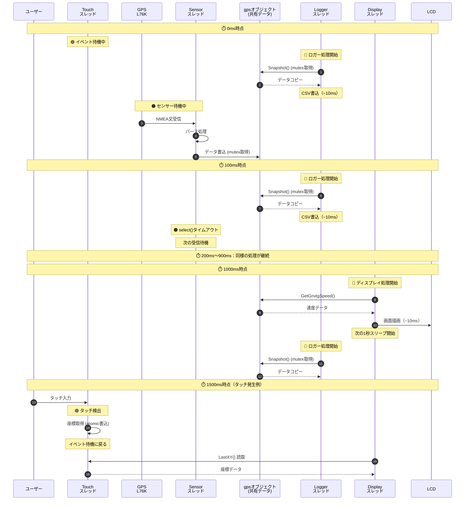

# スレッド構成

## 概要

本プロジェクトでは、リアルタイム性とレスポンスを両立させるため、マルチスレッド設計を採用している。各スレッドは独立した責務を持ち、非同期で動作する。

## 複数スレッドを使う理由

- **UIレスポンスの維持**: センサ取得やログ保存が遅くても画面表示を継続できる
- **並行処理の実現**: GPS受信、タッチ入力、データ記録、UI更新を同時実行
- **応答性の向上**: 特定の処理が他の処理をブロックせず、各処理が独立して動作

---

## スレッド一覧

### 1. Displayスレッド

- **役割**: UI更新（画面表示更新）
- **生成**: `DisplayManager` コンストラクタ
- **実装**: [display_manager.cc](../src/display/display_manager.cc) `DisplayManager::DisplayManager()`
- **処理**: GPSから速度データを取得し、LCD画面へテキスト描画（差分更新）
- **周期**: 1秒
- **終了**: `std::atomic<bool> running_` による制御、デストラクタで自動停止

### 2. ロガースレッド

- **役割**: センサデータのCSVログ記録
- **生成**: `Logger` コンストラクタ
- **実装**: [logger.cc](../src/util/logger.cc) `Logger::Logger()`
- **処理**: 内部ループでGPSスナップショットを取得し、`log_on_` フラグがtrueの場合のみCSVへ書き込み
- **周期**: 設定ファイル（`config/config.json`）の `log_interval_ms` で指定（デフォルト1000ms）
- **終了**: `std::atomic<bool> running_` による制御、デストラクタで自動停止

### 3. Sensorスレッド

- **役割**: センサー（GPS L76K等）からのデータ受信とパース
- **生成**: `std::thread sensor_thread` 生成
- **実装**: [main.cc](../main.cc) `[THREAD:SENSOR]` マーカー
- **処理**: UART経由で受信した生データをバッファリングし、改行区切りでNMEA文を抽出して `gps.ProcessNmeaLine()` でパース
- **周期**: タイムアウト付き（100ms）のイベント駆動
- **終了**: `util::g_shutdown_requested` をチェック、`select()` のタイムアウトで定期確認

### 4. タッチスレッド

- **役割**: タッチスクリーン（GT911）からの入力監視
- **生成**: `gt911::Touch` コンストラクタ
- **実装**: [gt911.cc](../src/display/touch/gt911.cc) `Touch::Touch()`
- **処理**: GPIO割り込みイベントでタッチ検出し、タッチ座標を内部変数へ保存（`LastXY()` でアクセス可能）
- **周期**: イベント駆動（200msタイムアウト）
- **終了**: `std::atomic<bool> running_` による制御、デストラクタで自動停止

---

## シーケンス図

### スレッドの並行動作とデータフロー（時系列）

各スレッドの実行タイミングとデータのやり取りを時系列で表現：

**スレッドの役割**:
- 🔵 ロガースレッド: 100ms周期でGPSデータをCSV記録
- 🟠 Sensorスレッド: イベント駆動 + 100msタイムアウトでセンサーデータ受信
- 🔴 Displayスレッド: 1秒周期で画面更新
- 🟢 タッチスレッド: イベント駆動（タッチ時のみ動作）

